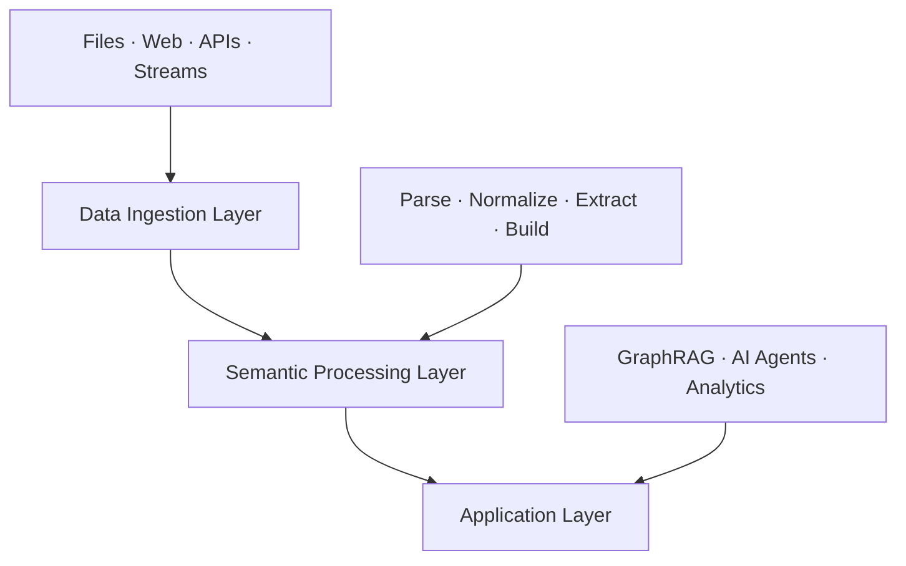

# Architecture

Semantica is built around a three-layer, modular architecture designed for independent use of components, clean separation of concerns, and extensibility at each layer.

---

## System Overview



---

## Three-Layer Architecture

### 1. Data Ingestion Layer

Responsible for loading data from any source into the pipeline.

- **File formats** — PDF, DOCX, HTML, JSON, CSV, Excel, PPTX, archives
- **Web** — crawl via `WebIngestor` with configurable depth
- **Databases** — SQL, NoSQL, Snowflake via `DBIngestor` / `SnowflakeIngestor`
- **Streams** — Kafka, real-time feeds

### 2. Semantic Processing Layer

The core intelligence engine — transforms raw data into structured knowledge.

- Document parsing and normalization
- Entity and relationship extraction (NER, LLM-typed, rule-based)
- Embedding generation
- Knowledge graph construction with entity merging
- Deduplication, conflict detection, and validation

### 3. Application Layer

Consumes the knowledge graph for downstream use cases.

- GraphRAG — graph-grounded retrieval for LLMs
- AI agent context and decision tracking
- Multi-agent pipelines
- Analytics, visualization, and export

---

## Data Flow

```
Ingest      →  raw data from sources
Parse       →  structured text extraction
Normalize   →  canonical forms, date/name standardization
Extract     →  entities, relationships, events
Build       →  entity resolution, graph construction
QA          →  deduplication, conflict resolution, validation
Store       →  vector store, graph store, triplet store
Deliver     →  GraphRAG, agents, export, visualization
```

---

## Module Map

| Layer | Modules |
|-------|---------|
| **Ingestion** | `ingest`, `parse`, `split`, `normalize` |
| **Semantic** | `semantic_extract`, `kg`, `ontology`, `reasoning` |
| **Storage** | `embeddings`, `vector_store`, `graph_store`, `triplet_store` |
| **Quality** | `deduplication`, `conflicts` |
| **Context** | `context`, `provenance`, `change_management` |
| **Output** | `export`, `visualization`, `pipeline` |

For full module documentation, see the [Modules Guide](modules.md).

---

## Extension Points

### Custom Ingestor

```python
from semantica.ingest import BaseIngestor

class CustomIngestor(BaseIngestor):
    def ingest(self, source):
        # Return a list of document dicts
        ...
```

### Custom Extractor

```python
from semantica.semantic_extract import BaseExtractor

class CustomExtractor(BaseExtractor):
    def extract(self, text):
        # Return a list of entity dicts
        ...
```

---

## Design Decisions

**Modularity** — every component can be used standalone. Import only what you need; the framework never forces a full stack.

**Pluggability** — extend any layer without modifying core code. Custom ingestors, extractors, validators, and exporters all follow the same base class pattern.

**Configuration over convention** — centralized config with environment variable overrides for deployment flexibility.

**Provenance by default** — lineage tracking is built into graph construction, not bolted on. Every node traces back to a source document.

---

## Performance Characteristics

- **Parallel execution** — `PipelineBuilder` supports configurable worker counts per stage
- **Delta processing** — incremental graph updates without full recompute
- **Streaming ingestion** — process large corpora without loading everything into memory
- **Backend flexibility** — swap in-memory NetworkX for Neo4j/FalkorDB at scale with no API changes
