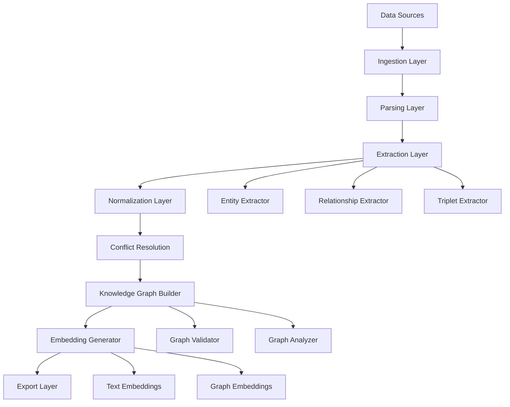
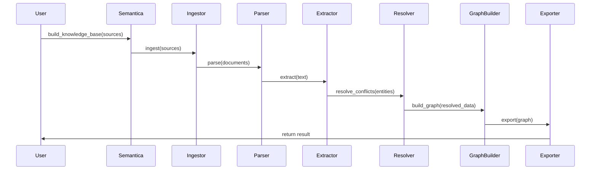
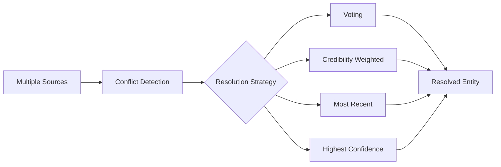

# Deep Dive

Internals, advanced concepts, and extension points for contributors and power users.

!!! tip "Just getting started?"
    Read [Architecture](architecture.md) for a higher-level overview first.

---

## Pipeline Internals

The full data flow through a Semantica pipeline:



### Sequence Diagram



---

## System Components

### Ingestion Layer

Handles input from any source:

- **FileIngestor** — PDF, DOCX, HTML, JSON, CSV, archives
- **WebIngestor** — URL crawling and scraping
- **DBIngestor** / **SnowflakeIngestor** — SQL databases
- **StreamIngestor** — Kafka and real-time feeds

### Parsing Layer

Converts raw data to structured text:

- Text and metadata extraction from documents
- OCR for scanned content
- Layout analysis (via Docling for tables and columns)

### Extraction Layer

Core semantic processing pipeline:

```
text → Tokenization → NER → Entity Linking → Entity Validation
```

Components: Named Entity Recognition, Relationship Extraction, Triplet Extraction, Coreference Resolution.

### Normalization Layer

Standardizes extracted data: entity names, date formats, numbers, encodings, and language normalization.

### Conflict Resolution

Handles contradictory facts from multiple sources:



### Knowledge Graph Builder

- Entity resolution across sources
- Edge creation (typed relationships)
- Property assignment with confidence scores
- Graph validation and quality checks

### Embedding Generator

- Text embeddings (Sentence-Transformers, FastEmbed, OpenAI, BGE)
- Graph embeddings (Node2Vec, GraphSAGE)

---

## Advanced Concepts

### Entity Resolution Algorithm

```python
def resolve_entities(entities, threshold=0.85):
    clusters = []
    for entity in entities:
        matched = False
        for cluster in clusters:
            if similarity(entity, cluster.representative) > threshold:
                cluster.add(entity)
                matched = True
                break
        if not matched:
            clusters.append(EntityCluster(entity))
    return clusters
```

### Relationship Inference

Semantica's reasoning engines can derive implicit relationships:

- **Transitive** — if A→B and B→C, infer A→C
- **Temporal** — before, after, during from timestamped facts
- **Causal** — IF/THEN rules via `Reasoner`
- **Hierarchical** — subclass/instance inference via `OntologyReasoner`

### Batch Processing for Large Datasets

```python
def process_large_dataset(sources, batch_size=100):
    for i in range(0, len(sources), batch_size):
        batch = sources[i : i + batch_size]
        result = semantica.build_knowledge_base(batch)
        save_result(result)
        del result
        gc.collect()
```

---

## Extension Points

### Custom Plugin

```python
from semantica.core import Plugin

class CustomPlugin(Plugin):
    def process(self, data):
        # Your custom processing logic
        return processed_data
```

### Custom Extractor

```python
from semantica.semantic_extract import BaseExtractor

class DomainSpecificExtractor(BaseExtractor):
    def extract(self, text):
        # Domain-specific entity extraction logic
        return entities
```

### Custom Ingestor

```python
from semantica.ingest import BaseIngestor

class CustomIngestor(BaseIngestor):
    def ingest(self, source):
        # Load and return document dicts
        return documents
```

---

## Internal APIs

| API | Purpose |
|-----|---------|
| `Semantica.build_knowledge_base()` | Main orchestration entry point |
| `GraphBuilder.build()` | Graph construction |
| `ConflictResolver.resolve()` | Conflict resolution |
| `EmbeddingGenerator.generate()` | Embedding generation |

Extension hooks: plugin registration, custom extractor registration, custom exporter registration, event hooks.

---

## Design Decisions

**Why modular architecture?** Each component is independently testable and swappable. You can use `NERExtractor` alone without pulling in graph storage or pipelines.

**Why built-in conflict resolution?** Multi-source data always has contradictions. Ignoring them produces garbage graphs. Explicit resolution strategies give you control over data quality.

**Why W3C PROV-O for provenance?** It's an industry standard with tooling support. Using a custom format would make lineage data non-portable.

**Why multiple reasoning engines?** Different problems need different reasoning: forward chaining for rule application, SPARQL for graph queries, abductive for hypothesis generation. No single engine fits all cases.

---

## Further Reading

- [Architecture](architecture.md) — high-level three-layer overview
- [Modules](modules.md) — every module with code examples
- [API Reference](reference/core.md) — complete technical reference
- [Contributing](contributing.md) — how to extend the framework
