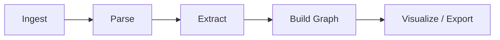

# Quickstart

Build your first knowledge graph in 5 minutes.

!!! tip "Prerequisites"
    Semantica installed (`pip install semantica`). If not, see the [Installation Guide](installation.md).

---

## Pipeline Overview



---

## Step 1 — Ingest

Load documents from files, directories, or the web.

```python
from semantica.ingest import FileIngestor

ingestor = FileIngestor()
sources = ingestor.ingest("data/sample.pdf")
```

Supported formats: PDF, DOCX, HTML, JSON, CSV, Excel, PPTX, archives. For web content, use `WebIngestor`.

---

## Step 2 — Parse

Extract structured text from raw documents.

```python
from semantica.parse import DocumentParser

parser = DocumentParser()
parsed = parser.parse(sources[0])
```

For complex layouts (tables, columns): use `DoclingParser` instead — it handles PDF tables and structured DOCX/PPTX better.

---

## Step 3 — Extract Entities and Relationships

```python
from semantica.semantic_extract import NERExtractor, RelationExtractor

ner = NERExtractor()
entities = ner.extract(parsed)

rel = RelationExtractor()
relationships = rel.extract(parsed, entities=entities)
```

Each entity gets a type, confidence score, and source reference. Relationships are extracted as typed triplets: `(subject, predicate, object)`.

---

## Step 4 — Build the Knowledge Graph

```python
from semantica.kg import GraphBuilder

builder = GraphBuilder(merge_entities=True)
graph = builder.build(entities=entities, relationships=relationships)

print(f"{len(graph.nodes)} nodes, {len(graph.edges)} edges")
```

`merge_entities=True` resolves duplicates across sources automatically.

---

## Step 5 — Visualize

```python
from semantica.visualization import GraphVisualizer

viz = GraphVisualizer()
viz.visualize(graph, output="graph.html")   # interactive HTML
```

---

## Step 6 — Export

```python
from semantica.export import RDFExporter

exporter = RDFExporter()
rdf = exporter.export_to_rdf(graph, format="turtle")
```

Other formats: `"json-ld"`, `"nt"`, `"xml"`, Parquet, ArangoDB AQL. See [Export Reference](reference/export.md).

---

## Common Patterns

### Process text directly (no file)

```python
from semantica.semantic_extract import NERExtractor

ner = NERExtractor()
entities = ner.extract("Apple Inc. was founded by Steve Jobs in 1976.")
```

### Incremental build from multiple sources

```python
from semantica.kg import GraphBuilder

all_entities, all_rels = [], []
for doc in parsed_docs:
    all_entities.extend(ner.extract(doc))
    all_rels.extend(rel.extract(doc, entities=all_entities))

graph = GraphBuilder(merge_entities=True).build(
    entities=all_entities, relationships=all_rels
)
```

---

## Troubleshooting

| Problem | Fix |
|---------|-----|
| No entities extracted | Check the document has machine-readable text (not just scanned images) |
| Slow processing | Process in chunks; use GPU acceleration (`pip install semantica[gpu]`) |
| Memory errors | Reduce batch size or switch to a persistent graph backend |

---

## Next Steps

- [Core Concepts](concepts.md) — understand how knowledge graphs and reasoning work
- [Modules Guide](modules.md) — every module explained
- [Use Cases](use-cases.md) — domain-specific examples
- [Cookbook](cookbook.md) — interactive Jupyter notebooks for each step
